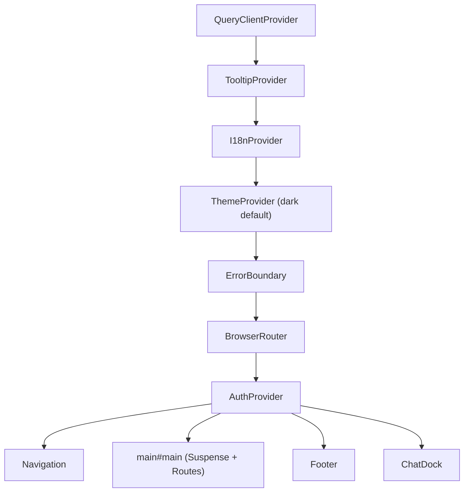
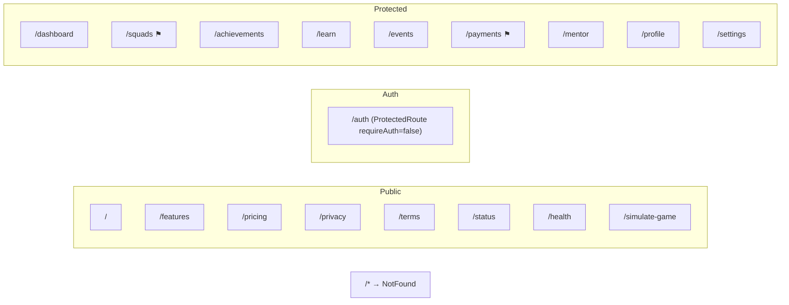
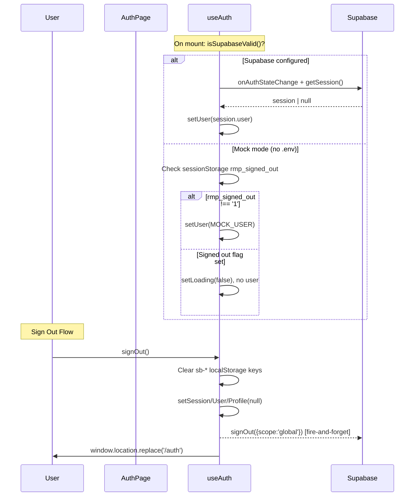
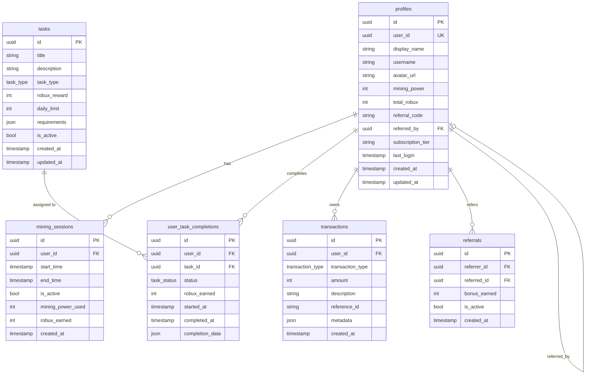

# RobuxMinerPro — System Architecture

> **Canonical Reference** — Any agent working on this codebase MUST read this document before making changes.

---

## Provider Tree

The React component tree wraps the app in a strict ordering. **Do not reorder providers.**



**Key invariants:**

- `AuthProvider` MUST be inside `BrowserRouter` (uses `useNavigate`)
- `ThemeProvider` stores preference in `localStorage` key `rmp-theme`
- All page components are `lazy()` loaded with `Suspense` fallback

---

## Route Map



⚑ = Feature-flagged: `VITE_FEATURE_SQUADS`, `VITE_FEATURE_PAYMENTS`

---

## Authentication Flow



**Sign-out invariant:** Local state is cleared SYNCHRONOUSLY. Server-side token revocation is fire-and-forget. The redirect happens instantly regardless of network conditions.

---

## Database Schema (Supabase)



**Enums:**
| Enum | Values |
|------|--------|
| `task_status` | `pending`, `in_progress`, `completed`, `failed` |
| `task_type` | `daily_login`, `watch_ad`, `complete_survey`, `referral`, `social_share`, `game_play` |
| `transaction_type` | `mining_reward`, `task_completion`, `referral_bonus`, `withdrawal`, `purchase` |

---

## API Proxy Map (Vite Dev Server)

| Frontend Path         | Backend Target                              | Purpose                 |
| --------------------- | ------------------------------------------- | ----------------------- |
| `/api/openai/*`       | `https://api.openai.com`                    | OpenAI chat completions |
| `/api/ollama/*`       | `http://localhost:11434`                    | Local Ollama inference  |
| `/api/engine/beta/*`  | `https://generativelanguage.googleapis.com` | Google Gemini API       |
| `/api/engine/alpha/*` | `https://api.groq.com/openai`               | Groq inference          |

> [!WARNING]
> These proxies only work in dev mode (`npm run dev`). In production, use Vercel Edge Functions (`api/chat.ts`).

---

## Directory Structure (Ownership)

```
src/
├── App.tsx                    # Root component — NEVER modify provider order
├── main.tsx                   # Entry point — NEVER modify
├── routes.tsx                 # Route definitions (unused, routes in App.tsx)
├── index.css                  # Global styles + Tailwind
├── components/
│   ├── auth/AuthPage.tsx      # Auth UI — BYPASS gated behind DEV
│   ├── Navigation.tsx         # Nav bar — signOut wiring lives here
│   ├── ProtectedRoute.tsx     # Route guard
│   ├── ErrorBoundary.tsx      # Global error boundary
│   ├── Footer.tsx             # Site footer
│   ├── HeroTitle.tsx          # Hero section title component
│   ├── LeadCaptureModal.tsx   # Lead capture form
│   ├── ThemeProvider.tsx      # Dark/light theme context
│   ├── ThemeToggle.tsx        # Theme switch button
│   ├── gamification/          # Reward/unboxing animations
│   ├── pip/                   # Picture-in-picture components
│   └── ui/                    # shadcn/ui primitives (48 components)
├── hooks/
│   ├── useAuth.tsx            # Auth context + signOut logic — CRITICAL
│   ├── use-toast.ts           # Toast notification system
│   ├── use-mobile.tsx         # Mobile viewport detection
│   └── useFocusTrap.ts        # Accessibility focus trap
├── integrations/supabase/
│   ├── client.ts              # Supabase client + Zod env validation
│   └── types.ts               # Auto-generated DB types — NEVER edit manually
├── i18n/                      # Internationalization
├── pages/                     # 25 page components (lazy loaded)
├── shared/                    # ChatDock, api.ts, brand.ts, config.ts
├── styles/                    # Additional stylesheets
├── lib/                       # Utility functions
└── types/                     # TypeScript type definitions
```
